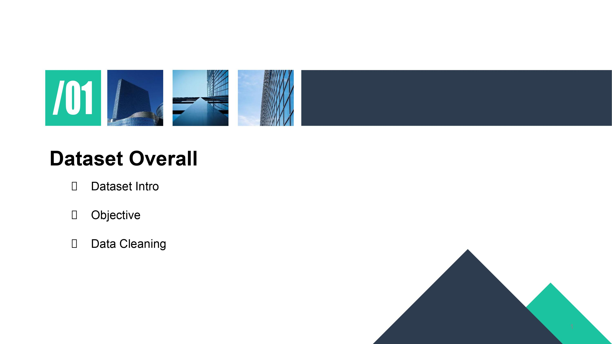
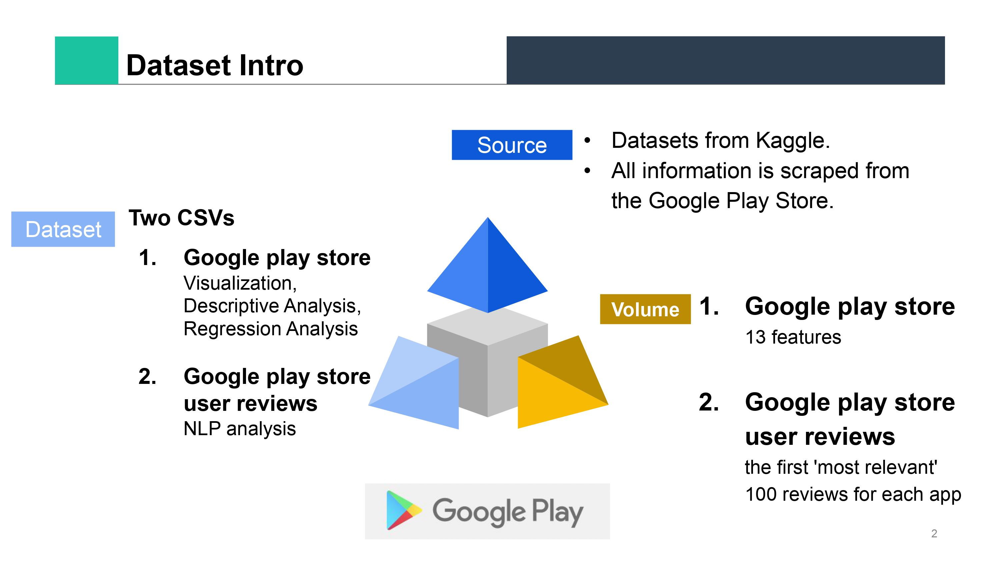
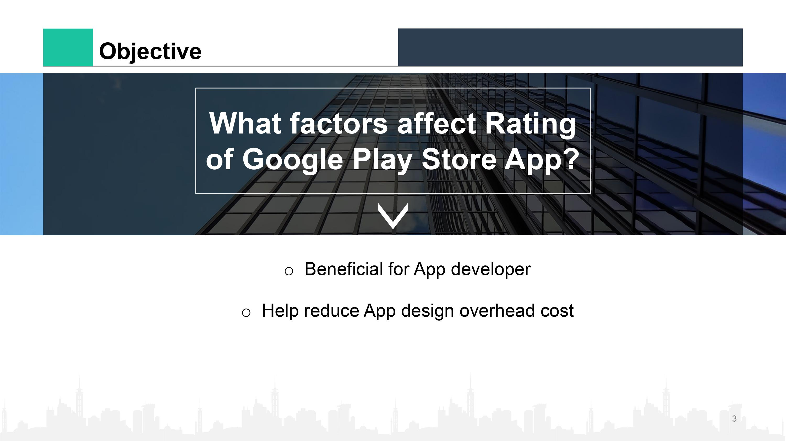
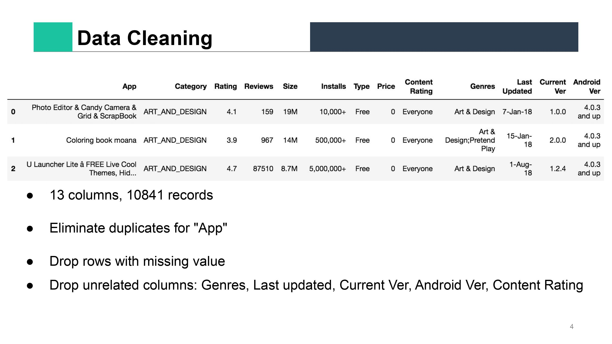
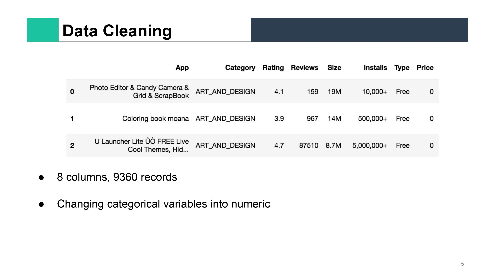
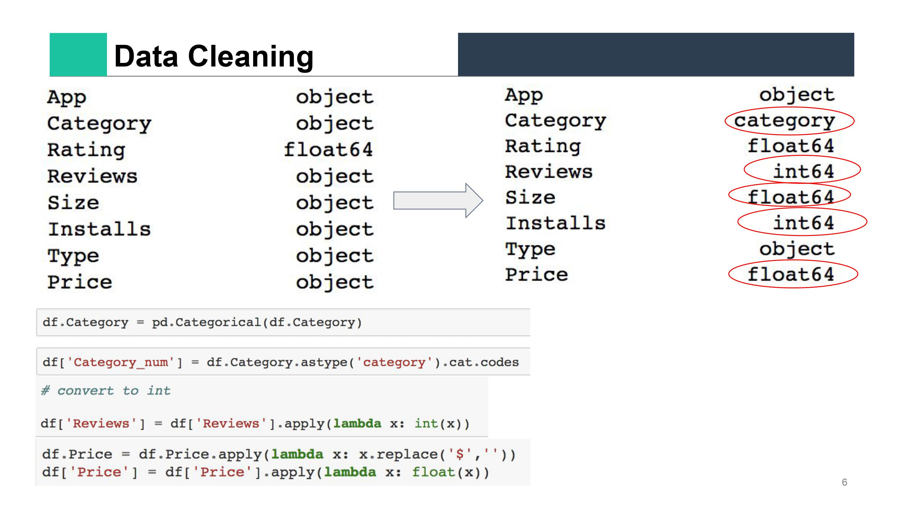
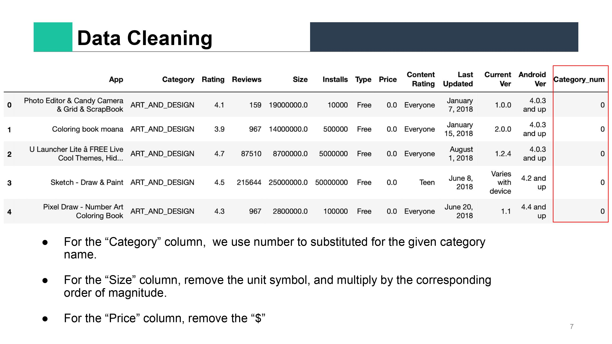
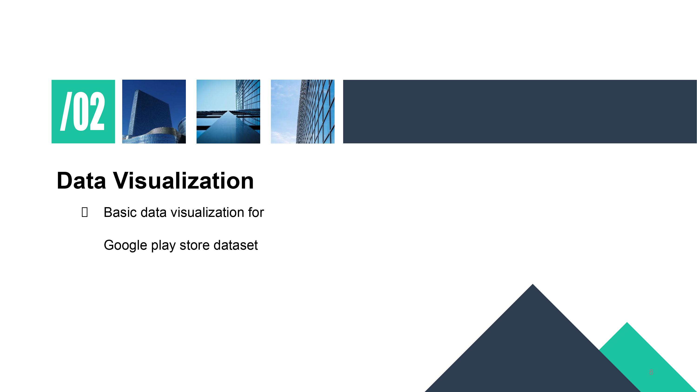
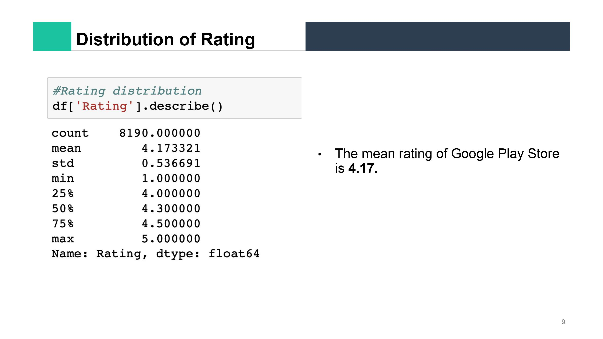

 
Create by: Cathy Xueqing Zhang  

# Google Play Store
Android is the dominant mobile operating system today with about 85% of all mobile devices running Google’s OS. The Google Play Store is the largest and most popular Android app store.  
The purpose of this project was to gather and analyze detailed information on apps in the Google Play Store in order to provide insights on app features and the current state of the Android app market.  
This two datasets Datasets from Kaggle.

