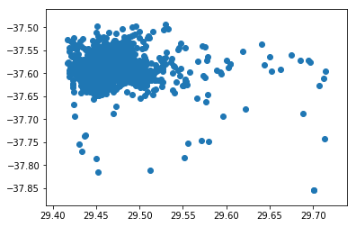
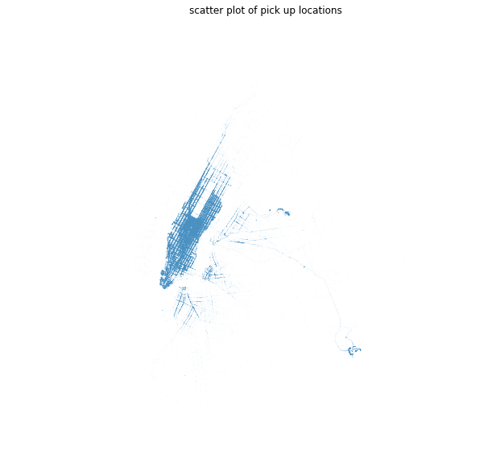
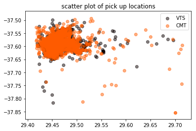
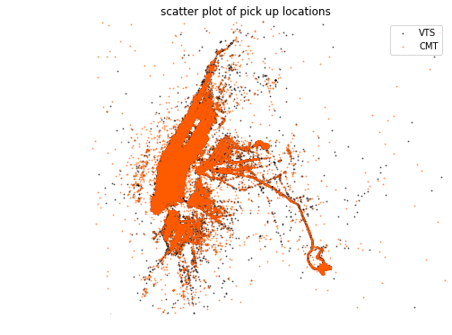

# NY Taxi Rides
<br/>
Data Provided by the New York City Taxi and Limousine Commission.
Full dataset is 170 million taxi trips, 100GB of free space. Our subset is 0.5% of all trips, about 850,000 rides. Download the dataset from Cyrille Rossant on GitHub: https://github.com/ipython-books/minibook-2nd-data (https://github.com/ipython-books/minibook-2nd-data) NYC Taxi & Limousine Commission website (http://www.nyc.gov/html/tlc/html/about/trip_record_data.shtml) NYC Gov data description website (http://www.nyc.gov/html/tlc/downloads/pdf/data_dictionary_trip_records_yellow.pdf)

<br/><br/>
This project will use 3 packages:

```import numpy as np 
import pandas as pd
import matplotlib
import matplotlib.pyplot as plt 
%matplotlib inline
```
Import dataset (CSV format (Comma Separated Values), which is a simple file format used to store tabular data, such as a spreadsheet or database.):
```
data_filename1 = 'nyc_data.csv' 
data_filename2 = 'nyc_fare.csv'

data = pd.read_csv(data_filename1, 
                   parse_dates=['pickup_datetime', 'dropoff_datetime'] )
data2 = pd.read_csv(data_filename2, 
                   parse_dates=['pickup_datetime'])
```
In order to analysis a dataset and create several proper visualizations.
<br/><br/>

## 1. To a Learning Outcome Upload the data and display data columns, number of rows, variable types, and numeric statistics + categorical variable frequencies, by using panda package

<br/>


<br/><br/>

## 2.Display a scatter plot of pick up locations. For which vendor is it easier to find a cab?


<br/> Display a scatter plot of pickup locations Matplotlib scatter function makes a scatter plot of x vs y, where x and y are sequence like objects of the same length. Documentation: [http://matplotlib.org/api/pyplot_api.html#matplotlib.pyplot.scatter](http://matplotlib.org/api/pyplot_api.html#matplotlib.pyplot.scatter)<br/>
```
plt.scatter(px, py)
```

However, this plt is hard to read.<br/>
Thus, I customize the plot:
-Make markers smaller
-Make fewer points by making some points transparent
-Zoom in around Manhattan
-Make figure bigger
-Don't display the axes
plt or matplotlib.pyplot is a collection of command style functions. Each pyplot function makes some change to a figure: e.g., creates a figure, creates a plotting area in a figure, plots some lines in a plotting area, decorates the plot with labels, etc. ...<br/>
```
# Specify the figure size
plt.figure(figsize=(10, 10))
# s argument is used to make the marker size smaller
# alpha specifies opacity
plt.scatter(px, py, s=0.1, alpha=0.03)
# equal aspect ratio
plt.axis('equal')
# zoom in
plt.xlim(29.40, 29.55)
plt.ylim(-37.63, -37.54)
# remove the axes
plt.axis('off')
# set title
plt.title("scatter plot of pick up locations")
plt.show()
```
<br/>
We can find the second one is much clear.<br/>
<br/>
#### To distinghuish different vendors, we need to plot them in difference colors to see if there is any findings
```uniq = list(set(data['vendor_id']))
#set the color map to match the number of vendor
z = range(1,len(uniq))
cmap = matplotlib.cm.get_cmap('hot')
normalize = matplotlib.colors.Normalize(vmin=0, vmax=len(uniq))
scalarMap = matplotlib.cm.ScalarMappable(norm=normalize, cmap=cmap)
for i in range(len(uniq)):
    indx = data['vendor_id'] == uniq[i]
    plt.scatter(px[indx], py[indx],color=scalarMap.to_rgba(i), label=uniq[i], alpha=0.5)
plt.title("scatter plot of pick up locations")
plt.legend(loc='upper right')
plt.show()
```

Also Customize it


Conclusion: VTS is more popular in NYC. The distribution of the amount paid is shown above. Compare to the original dataset, there are some outliers that are not easy shown in the graph.
- For instance, there are some trips with payment greater than $200 or been negative (may due to some promos), which are not shown because of the small frequency.
- From the current plot of over 500 thousand trips, we can observe that most trips cost between $0 - 25 and trips with $0 - 75 take up the majority of the orders.


