Creat by: Cathy Xueqing Zhang
This project analyze google search advertisement: Paid Search. Paid search is a form of digital marketing where search engines such as Google and Bing allow advertisers to show ads on their search engine results pages (SERPs). Paid search works on a pay-per-click model.<br/>
<br/><br/>
# Data Acquisition 
- Collect data on the 7 verticals: Auto Insurance, Hotels, Tech, Crowdfunding, Clinical Trials, E-commerce Retail, Local Services.
- Focus on the 4 dimensions of paid search: CPC, Volume, Results, Competition (See the next section for the definition of dimensions.)
<br/><br/>
## 1. Data Source Description 
<br/>
SEMrush database is the source we target to collect the data. It provides two subsets of the database that are valuable.
<br/><br/>

### 1.1 Keywords Database

<br/>
For each keyword in every vertical, the database provides the data of 8 dimensions related to the target one as listed below:<br/>


<br/>Dimensions |	Description
------------ | -------------
Volume | Average times users searched for the keywords related to the selected vertical
Results | The number of URLs displayed for the keywords related to the selected vertical
CPC(USD) | Average Price the advertiser pays for one per click
Competition | Competitive density of advertiser
KD | How difficult it would be to rank well in organic search for the keywords in selected vertical
Trend | Number of Volume for the past 12 months
A list of related keywords | A list of keywords that are similar to the target one
A list of phrase-matched keywords | A list of keywords that contain exact keyword or keyword in various order 


<br/>A snapshot of the first six dimensions
 
 
<br/><br/>
#### 1.1.2 A list of related keywords 
<br/>
Based on the algorithm of the SEMrush database, the related keywords are a list of keywords that are similar to the target one. (Similarity is based on the sense of a word)

<br/>Each related keyword has a metric that measure how closely related to the target one. (0 ~100%)
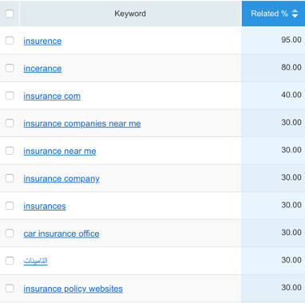
<br/> A snapshot of an example of the keywords:

 <br/><br/>
#### 1.1.3 A list of phrase-matched keywords 
<br/>
Based on the algorithm of the SEMrush database, the phrase-matched keywords are a list of keywords that contain exact keyword or keyword in various order 
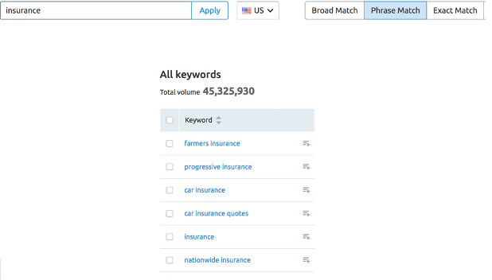
<br/>A snapshot of an example of the keywords:
 

<br/><br/>
### 1.2 Domain Database
<br/>
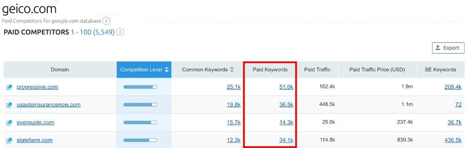
A snapshot of how the data look like taking one of the car insurance domain as example:

 

The use of this data will be discussed in Future Plan section.
<br/><br/>

## 2. Methods
### 2.1 Rationale
<br/>
In order to acquire the data for every vertical, we intend to collect all keywords which the targeted vertical is using for paid search and use the integrated keywords to calculate the data of the dimensions for each vertical.
<br/>
To collect all keywords of each vertical, we use the related and phrase match algorithm to estimate the totality.
<br/><br/>

### 2.2 Specific steps:


- Step 1: Set a seed keyword, normally it should be an exclusive keyword that the vertical use in paid search.
- Step 2: Set a threshold for the related metric, then acquire a list of keywords related to the seed.
- Step 3: For each keyword in the list acquired in step 2, collect the list of phrase match keywords.
- Step 4: Integrate all the data from step 3 include columns of keyword, and its dimensions.
- Step 5: Select a subset of the dataset from step 4 to calculate the data for whole vertical.

<br/><br/>
## 3 Overall result of Data Acquisition
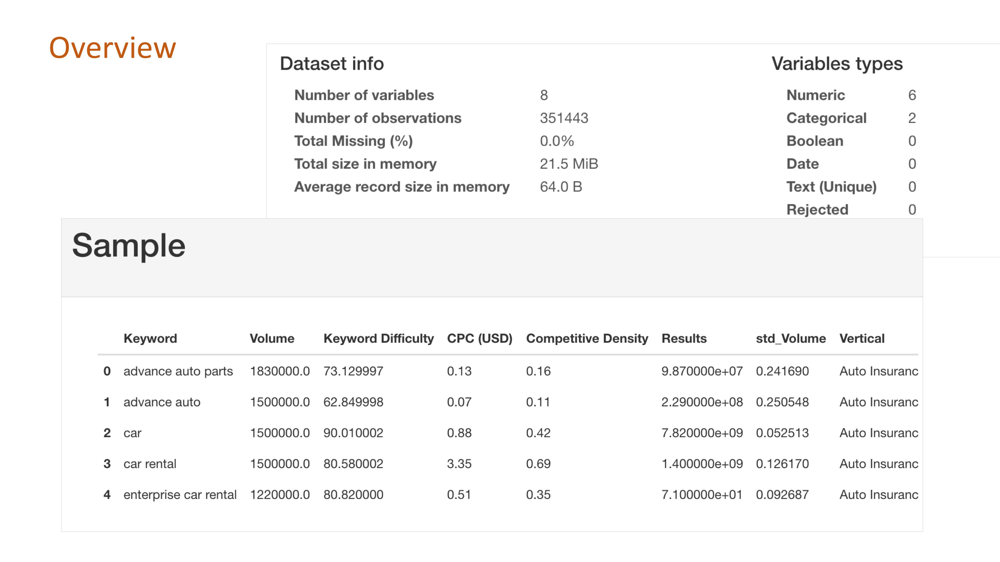
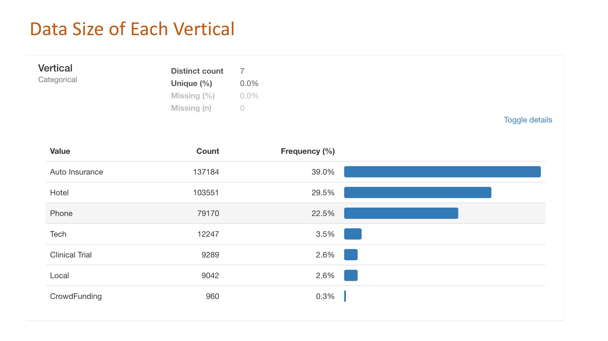
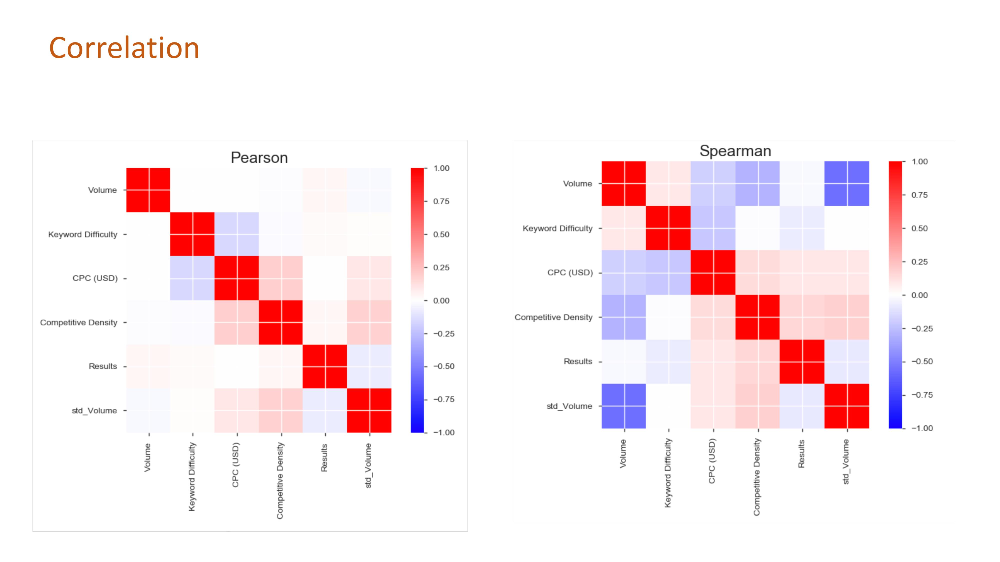
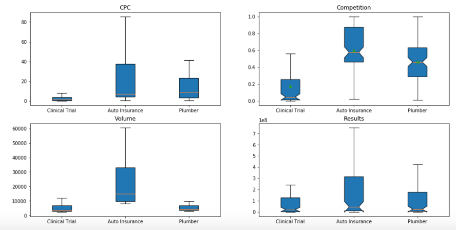
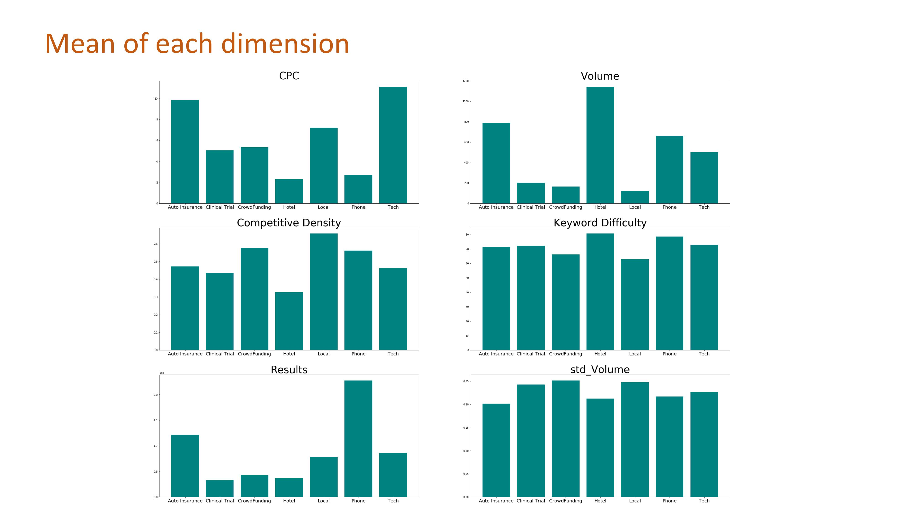

<br/><br/>
# Data Modeling
## Regression Model
I have also considered analyzing the relationship between the values of CPC and paid attention token.
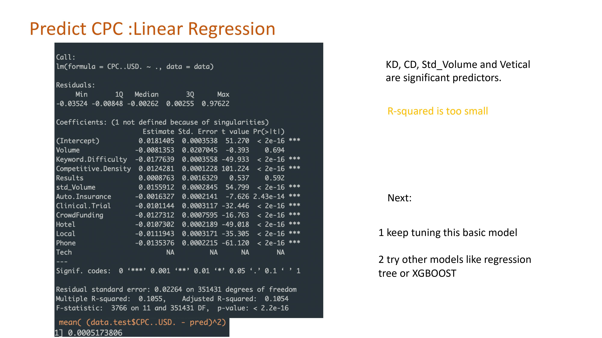
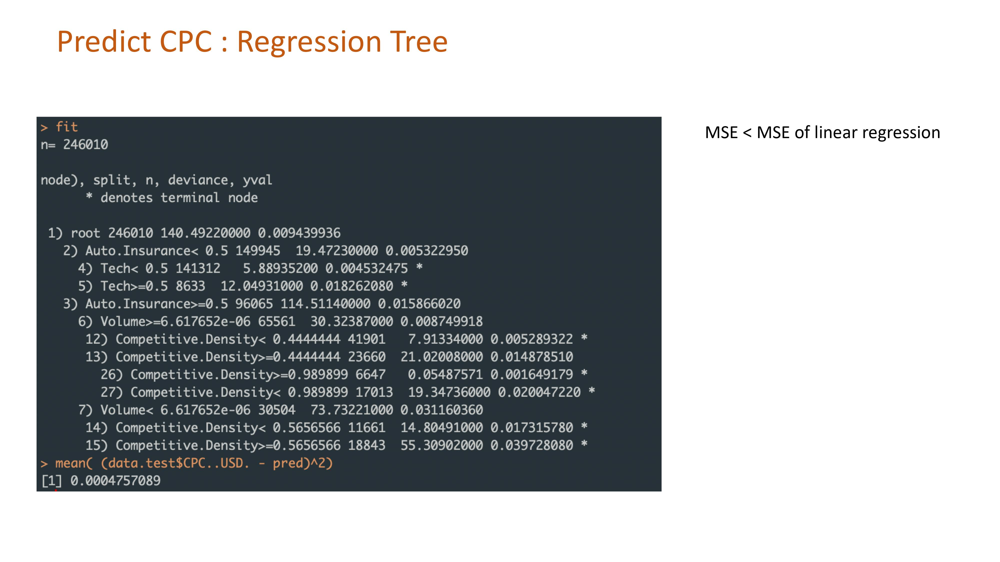
<br/> There is no meaningful result from the regular regression model.
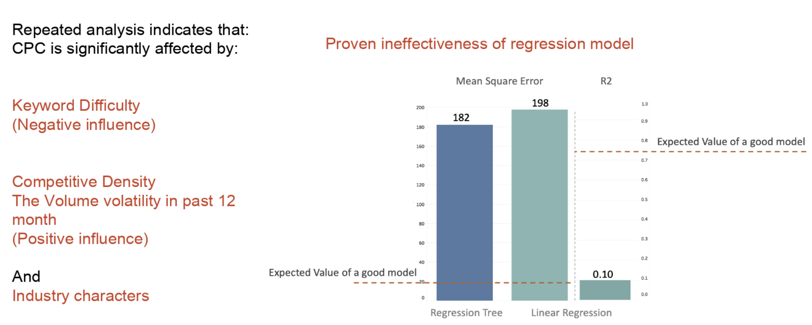
<br/>By running the regression model, unfortunately, we did not find a proper model to show the relationship between keywords and cpc value. On the left side of histogram, we plotted a regression tree with mean square error of 182 and a linear regression with mean square error of 198. However, the expected value of a good model should be below 20. On the other hand, the R^2 we have contributed is 0.1 which is a relatively low value, compared to the expected value of a good model being 0.75…

<br/><br/>
## T-SNE Model
t-Distributed Stochastic Neighbor Embedding (t-SNE) is an unsupervised, non-linear technique primarily used for data exploration and visualizing high-dimensional data. 
```Python (type)
from numpy import array
from numpy import argmax
from sklearn.preprocessing import LabelEncoder
from sklearn.preprocessing import OneHotEncoder
import seaborn as sns
import pandas as pd
from sklearn import preprocessing
import numpy as np
import matplotlib.pyplot as plt
from sklearn import manifold, datasets

# prepare data 
x_col=list(merge.columns)
x_col.remove('Vertical')
x_col
X, y = np.array(merge[x_col]), np.array(merge['Vertical'])                                   
n_samples, n_features = X.shape
min_max_scaler = preprocessing.MinMaxScaler()
X=min_max_scaler.fit_transform(X)
```
The t-SNE algorithm calculates a similarity measure between pairs of instances in the high dimensional space and in the low dimensional space.
```Python (type)
def visualize(x):
    target_names=a
    target_ids = range(len(target_names))

    plt.figure(figsize=(16, 16))
    colors = [0.86      , 0.3712    , 0.34      ], [0.86      , 0.81691429, 0.34      ],
    [0.45737143, 0.86      , 0.34      ], 
    [0.34      , 0.86      , 0.66834286],  
    [0.34      , 0.60594286, 0.86      ], 
    [0.51977143, 0.34      , 0.86      ],  [0.86      , 0.34      , 0.75451429]
    for i, c, label in zip(target_ids, colors, target_names):
        plt.scatter(x[y == i, 0], x[y == i, 1], c=c, label=label)
    plt.axis('off')
    plt.axis('tight')
    #plt.legend(fontsize=22)
    plt.show()
 ```
 After using plot_tsne with different steps, I get the following image.
 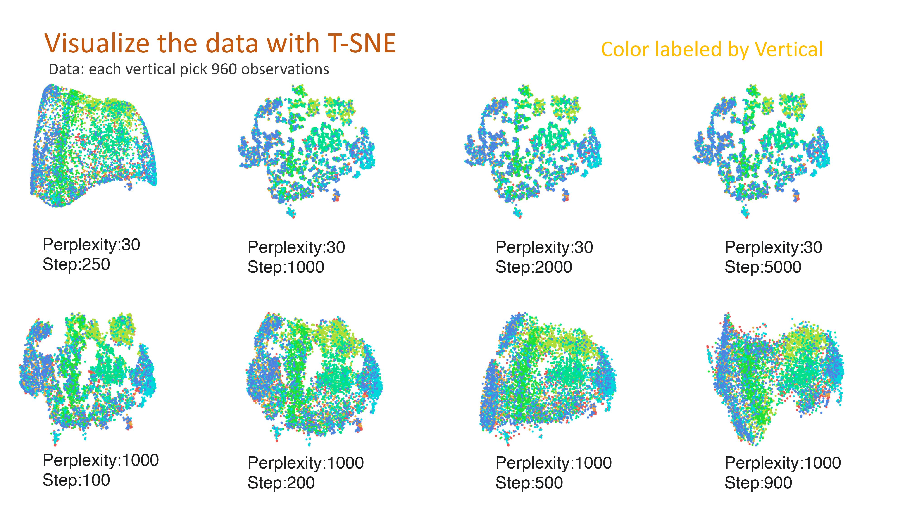
<br/> For t-sne model, I found the more difficult the keywords are, the CPC are lower, which means they are in a negative influence. On the other hand, competitive density has a positive influence on the CPC value. So is the volume volatility. I have tried both with a full dataset and each industry individually. The results are the same.


